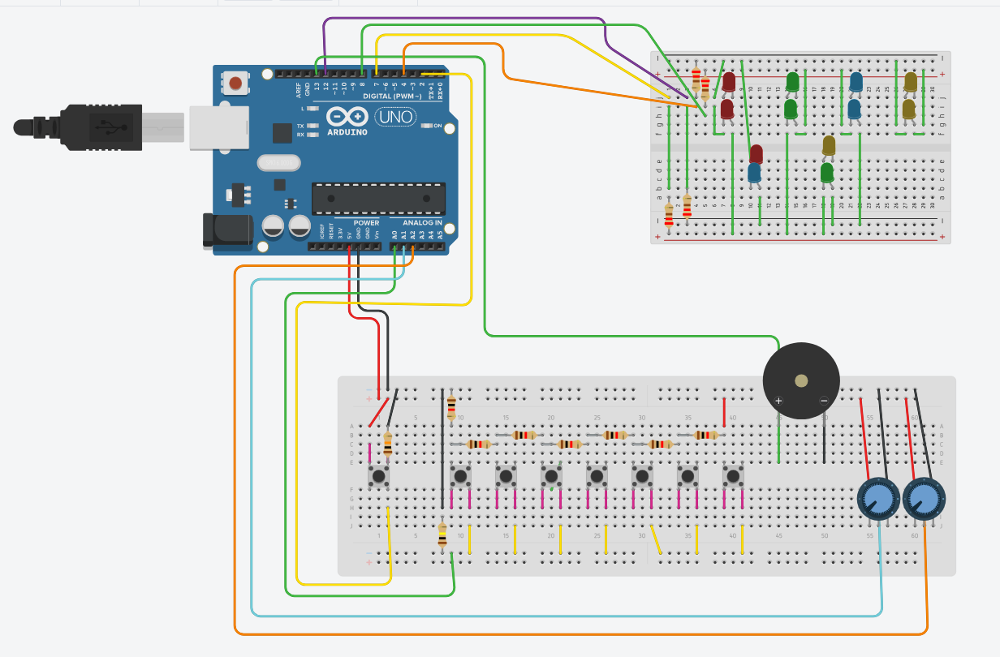
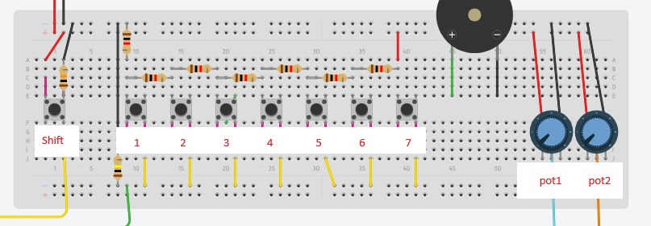

# blipblopsequencer
A program for used on a Arduino Uno to create a simple sequencer that can record and repeat a sequence played bt the user.
We have used [PlatformIO](https://platformio.org/) to be able to build and upload our program to our Arduinos.

We have a CAD that can be viewed here: 

## set_up
To clone and run program follow these set up steps: 

1. Install PlatformIO - Download the PlatformIO IDE extension in you IDE. 
2. Clone and open project. You should now be able to use PlatformIO to build the program and upload it to your arduino. 

## keybinds && functionality
The Sequencer is set up to use one of the buttons in combination with the other. 

### button_layout

### functionality

TBD

